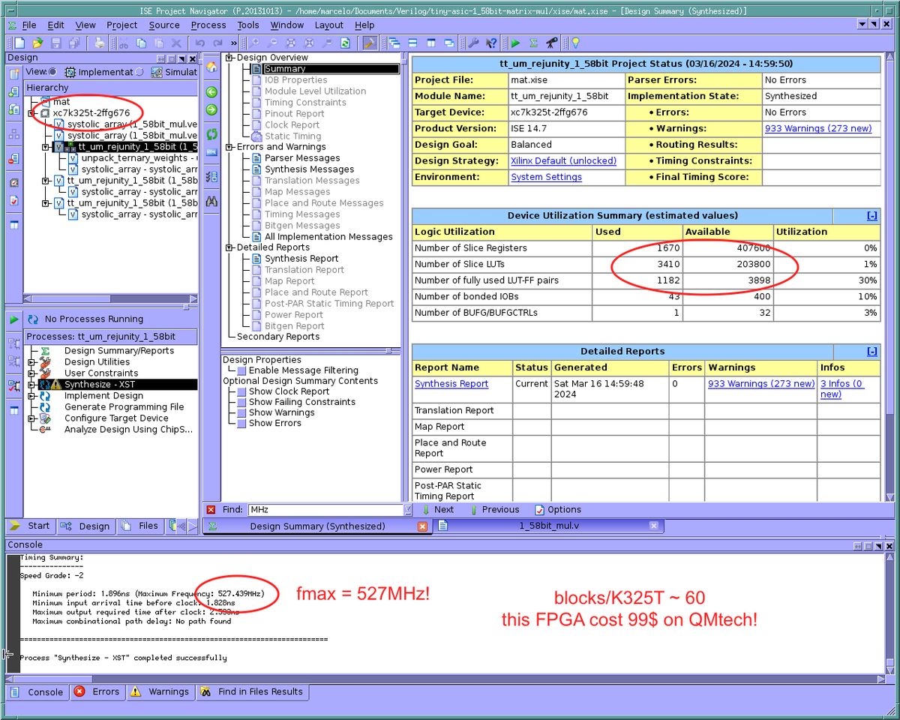

  

# Tiny matrix multiplication ASIC for 1.58 bit aka TERNARY weight LLMs 

This work is inspired by [The Era of 1-bit LLMs: All Large Language Models are in 1.58 Bits](https://arxiv.org/pdf/2402.17764.pdf) paper that reduces weights of the [Large Language Model](https://en.wikipedia.org/wiki/Large_language_model) to ternary representation `{-1, 0, 1}`.

Preliminery **performance** results based on simulations:
* eFabless 130nm ASIC - **1 GigaOPS** per 0.2 square millimeter of chip area @ 50 MHz
* $99 FPGA - **0.6 TeraOPS** @ 500 MHz (thanks to [@samsoniuk](https://github.com/samsoniuk) for quick synthesis!)

Observation: _**doubling** the chip area leads to **50%** increase in performance given a constant memory bandwidth and clock frequency._



## Intent & ASIC
This implementation is an exploration of the design space - intent is to measure how chip area, precsion and memory bandwidth affects the performance of the systolic array and AI accelerators.

This ASIC will be fabricated using eFabless 130 nm process via [Tiny Tapeout](https://tinytapeout.com).


## Considerations
This implementation takes the following considerations into account:
* Extremely limited chip area ~ 0.1 .. 0.3 square millimeters.
* Extremely low memory bandwidth limited by the 16 IO pins available in Tiny Tapeout ~ 100 MB/s.
* Be able to increase compute regardless of memory bandwidth.

## Implementation
**Ternary weights.** Currently a pretty basic approach is used to decode 5 ternary values from every 8 bits. 8-bit values are decoded with a huge case statement. Surprisingly it produces a pretty compact logic. But I am sure it in can be done better!
```
    always @(*) begin
      case(packed_weights)
        8'd000: begin weights_zero = 5'b11111; weights_sign = 5'b00000; end //   0  0  0  0  0
        8'd001: begin weights_zero = 5'b01111; weights_sign = 5'b00000; end //   0  0  0  0  1
        8'd002: begin weights_zero = 5'b01111; weights_sign = 5'b10000; end //   0  0  0  0 -1
        // ...
```

**Systolic array.** The matrix multiplication is implemented as an activation stationary "pseudo" systolic array. It is "pseudo" because inputs (weights & activations) are directly connected to all elements in the array. Only results (new activations) are shifted out of the array in a systolic manner. Such implementation is closer to Tesla FSD rather than a Google's TPU.

**Compute slices.** Systolic array is split into compute slices. Slicing allows to increase the size of systolic array and compute power even if memory bandwidth stays the same.
```
     `define COMPUTE_SLICES 4    // 4 * 5 = 20 ops per clock cycle.
                                 // Running on a 50 MHz clock this results in 1000M operations per second - 1 GigaOPS
```

## Code!

- The code is rather small and fits in one Verilog file [1_58bit_mul.v](src/1_58bit_mul.v)
- Python cocotb is used for testing, check [test.py](test/test.py)
- You can change the size of the systolic array in [config.v](src/config.v)
- [You could read the documentation for the project, however not much there yet ;) ](docs/info.md)


# What is Tiny Tapeout?

TinyTapeout is an educational project that aims to make it easier and cheaper than ever to get your digital designs manufactured on a real chip.

To learn more and get started, visit https://tinytapeout.com.
- [FAQ](https://tinytapeout.com/faq/)
- [Digital design lessons](https://tinytapeout.com/digital_design/)
- [Join the community](https://tinytapeout.com/discord)
